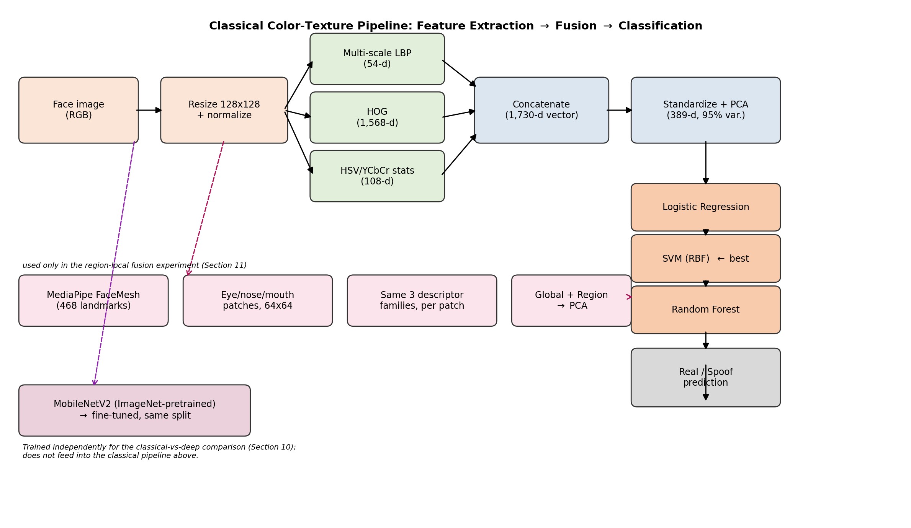

# Face Anti-Spoofing via Color-Texture Analysis
### A Classical-Baseline Presentation Attack Detection (PAD) Study, Re-Examined

[](https://github.com/Sandilya-17/Face-antispoofing/actions/workflows/ci.yml)
[](LICENSE)
[](data/README_DATA.md)
[](requirements.txt)
[](report/REPORT.md)

> P.V. Sai Sandilya · Sk Nagur Valli · G Shanmukh Reddy

---

## Abstract

Face recognition systems are vulnerable to *presentation attacks* — printed
photos, replays, and (in this corpus) expert-composited images — that try to
fool a sensor into accepting an impostor as a live subject. This project
implements and rigorously evaluates a **face anti-spoofing (FAS) /
presentation attack detection (PAD)** pipeline built entirely on
hand-crafted color-texture descriptors, in the tradition of Boulkenafet et
al. (2015, 2016) and the Local Binary Pattern operator of Ojala et al.
(2002). Multi-scale LBP micro-texture, HOG shape/edge, and HSV/YCbCr
color-reproduction statistics (1,730-d) are extracted from 2,041 face
images and classified with cross-validated Logistic Regression, SVM-RBF,
and Random Forest models. The best classical model (SVM-RBF) reaches
**69.1% accuracy / 0.736 AUC** on a held-out in-domain test set, with 5,000
bootstrap-resampled 95% CIs and a 30-repeat paired-significance test
confirming the SVM–LogReg gap is real (p < 1e-8), not noise.

Beyond the baseline, this repo runs the experiments a reviewer would ask
for: an **ablation** isolating each descriptor's contribution, a **hybrid
region + global fusion**, a **forensics feature (ELA / noise-residual)
fusion**, a **GAN-reconstruction one-class anomaly score fused with the
classical model**, and — critically — an honest **cross-dataset and
leave-one-dataset-out (LODO) generalization test** against a second,
independently-sourced corpus (NUAA). That last experiment is the paper's
most important finding: **in-domain performance (~0.74 AUC) collapses to
chance (~0.50 AUC, ACER ≈ 0.50) under domain shift**, which is reported
here in full rather than hidden — see [§ Limitations](#honest-limitations--negative-results).

**Full report:** [`report/REPORT.md`](report/REPORT.md) · **Compiled paper:** [`report/paper.pdf`](report/paper.pdf) · **Citation metadata:** [`CITATION.cff`](CITATION.cff)

---

## Table of Contents

- [Key Results](#key-results)
- [Method](#method)
- [Repository Structure](#repository-structure)
- [Reproducing the Results](#reproducing-the-results)
- [Development & Testing](#development--testing)
- [Honest Limitations / Negative Results](#honest-limitations--negative-results)
- [Dataset & Licensing](#dataset--licensing)
- [Citation](#citation)
- [References](#references)

---

## Key Results

### 1. Baseline classifier comparison (in-domain, held-out test set)

| Model | Accuracy | Precision | Recall | F1 | AUC |
|---|---|---|---|---|---|
| Logistic Regression | 0.681 | 0.640 | 0.729 | 0.682 | 0.708 |
| **SVM-RBF (best)** | **0.691** | 0.658 | 0.708 | 0.682 | **0.736** |
| Random Forest | — | — | — | — | (weakest CV F1, 0.429) |

95% bootstrap CI (n=5,000) for SVM-RBF: accuracy [0.638, 0.743], AUC
[0.681, 0.789]. Paired comparison across 30 independent random splits:
SVM-RBF beats LogReg by +0.035 mean accuracy (paired t-test p=3.2e-9,
Wilcoxon p=3.8e-6) — see [`results/statistical_significance.json`](results/statistical_significance.json).

### 2. Ablation: which descriptor family actually matters (SVM-RBF)

| Feature set | Dims (raw → PCA) | Accuracy | AUC |
|---|---|---|---|
| LBP only | 54 → 16 | 0.537 | 0.550 |
| Color (HSV+YCbCr) only | 108 → 54 | 0.534 | 0.564 |
| HOG only | 1,568 → 348 | 0.687 | **0.750** |
| **Combined (LBP+Color+HOG)** | 1,730 → 389 | **0.691** | 0.736 |

HOG alone nearly matches the full fused model and has the highest single
AUC — the fused model's Random-Forest Gini importance confirms HOG
accounts for **92.3%** of decision weight vs. 4.9% (color) and 2.7% (LBP).
This is flagged as a *specific, testable* explanation (edge discontinuities
at image-splice boundaries), not a vague "GAN artifact" claim — see
[`data/README_DATA.md`](data/README_DATA.md) for why that reframing matters.

### 3. Fusion extensions (all vs. the `global_only` SVM-RBF baseline, AUC 0.736)

| Fusion variant | Accuracy | AUC | Verdict |
|---|---|---|---|
| Global + facial-region features | 0.687 | **0.764** | best AUC gain from added signal |
| Global + splice-forensics (ELA/noise-residual) | 0.681 | 0.739 | marginal |
| Global + GAN-reconstruction anomaly score | 0.550 | 0.643 | **hurts** — GAN score alone is ~chance (AUC 0.499) |
| Global + region + GAN (stacked) | 0.658 | 0.725 | GAN signal adds noise, not information |
| Global/region **score-level** fusion (α=0.5) | 0.694 | 0.765 | best overall AUC across all variants |

Full numbers: [`results/hybrid_fusion_results.json`](results/hybrid_fusion_results.json),
[`results/gan_fusion_results.json`](results/gan_fusion_results.json),
[`results/forensics_fusion_results.json`](results/forensics_fusion_results.json),
[`results/score_fusion_results.json`](results/score_fusion_results.json).

### 4. Cross-dataset generalization (the reason this reads as a real study, not a demo)

| Test | Accuracy | AUC | APCER | BPCER | ACER |
|---|---|---|---|---|---|
| In-domain (CIPLAB test split) | 0.691 | 0.736 | — | — | — |
| **Cross-dataset**: train CIPLAB → test NUAA (n=12,611) | 0.405 | 0.507 | 0.998 | 0.002 | 0.500 |
| **LODO** mean (train on one corpus, test on the other, both directions) | 0.439 | 0.469 | 0.505 | 0.494 | **0.500** |

An ACER of ~0.50 is chance-level for a binary detector. Source data:
[`results/cross_dataset_metrics.json`](results/cross_dataset_metrics.json),
[`results/lodo_results.json`](results/lodo_results.json).

---

## Method

Three complementary descriptor families are concatenated into a
**1,730-dimensional** feature vector per 128×128 RGB face crop
([`src/feature_extraction.py`](src/feature_extraction.py)):

1. **Multi-scale uniform LBP** (54-d) — histograms at (P=8,R=1), (P=16,R=2),
   (P=24,R=3); fine-to-coarse skin/paper micro-texture.
2. **Color-space statistics** (108-d) — per-channel mean, std, 16-bin
   histogram in **HSV** and **YCbCr**; captures print/replay
   color-reproduction shift.
3. **HOG** (1,568-d) — 8 orientation bins, 16×16 cells, 2×2-block
   normalization; edge/shape structure, dominant contributor (see ablation).

**Pipeline** ([`src/train_evaluate.py`](src/train_evaluate.py)):
`StandardScaler` (train-fit only) → `PCA` (95% variance retained, 1,730 →
389 dims) → 5-fold stratified CV grid search (LogReg / SVM-RBF / Random
Forest, optimizing F1) → held-out test evaluation (accuracy, precision,
recall, F1, ROC-AUC, confusion matrix, per-difficulty breakdown).

Extension experiments reuse this exact scaffold with additional feature
extractors: `region_features.py` (facial-region-localized descriptors),
`splice_forensics_features.py` (Error Level Analysis + SRM-lite noise
residuals), and `gan_reconstruction.py` (autoencoder reconstruction-error
anomaly score, feature-space scored via `gan_feature_space_scoring.py`).



---

## Repository Structure

```
Face-antispoofing/
├── data/
│   └── README_DATA.md              # dataset provenance, license, and a
│                                    # documented correction (Photoshop
│                                    # composites, NOT GAN-generated fakes)
├── src/
│   ├── feature_extraction.py       # LBP + color + HOG descriptors
│   ├── build_dataset.py            # -> results/features.npz
│   ├── build_dataset_region.py     # facial-region feature variant
│   ├── build_dataset_forensics.py  # ELA / noise-residual features
│   ├── build_dataset_combined.py   # multi-source dataset build
│   ├── build_multi_dataset.py      # CIPLAB + NUAA combined build (for LODO)
│   ├── region_features.py          # region-localized descriptor extractor
│   ├── splice_forensics_features.py
│   ├── gan_reconstruction.py       # one-class AE anomaly scorer
│   ├── gan_feature_space_scoring.py
│   ├── augment_classical.py        # classical augmentation for training
│   ├── augmented_training.py
│   ├── deep_baseline_mobilenetv2.py# transfer-learning deep baseline
│   ├── train_evaluate.py           # main CV / train / eval / plots
│   ├── train_evaluate_combined.py
│   ├── train_hybrid_fusion.py      # global + region fusion
│   ├── train_forensics_fusion.py   # global + forensics fusion
│   ├── train_gan_fusion.py / train_gan_score_fusion.py / train_gan_stacked_fusion.py
│   ├── train_score_fusion.py       # decision-level score fusion
│   ├── cross_dataset_eval.py       # train-CIPLAB / test-NUAA
│   ├── leave_one_dataset_out.py    # LODO evaluation
│   ├── ablation_study.py           # per-descriptor-family ablation
│   ├── statistical_significance.py # bootstrap CIs, paired t-test, Wilcoxon
│   └── predict.py                  # single-image inference
├── results/                        # all metrics (JSON), trained models,
│   └── figures/                    # figures (confusion matrices, ROC,
│                                    # ablation, fusion, LODO plots)
├── report/
│   ├── REPORT.md                   # full write-up (intro → limitations)
│   └── paper.pdf                   # compiled paper with figures
├── paper/figures/                  # source figures used in the paper
├── CITATION.cff                    # machine-readable citation metadata
├── LICENSE                         # MIT (code)
└── requirements.txt
```

---

## Reproducing the Results

```bash
# 1. Environment
python3 -m venv venv && source venv/bin/activate
pip install -r requirements.txt

# 2. Get the data (see data/README_DATA.md for full provenance/licensing)
git clone https://github.com/Sandilya-17/dataset.git /tmp/dataset_repo
ln -s /tmp/dataset_repo/real_and_fake_face_detection/real_and_fake_face data/real_and_fake_face

# 3. Baseline pipeline
cd src
python3 build_dataset.py            # ~50s -> results/features.npz
python3 train_evaluate.py           # ~2 min -> metrics, models, figures
python3 predict.py <path/to/image.jpg>

# 4. Extension experiments (optional, run any subset)
python3 ablation_study.py
python3 statistical_significance.py
python3 build_dataset_region.py && python3 train_hybrid_fusion.py
python3 build_dataset_forensics.py && python3 train_forensics_fusion.py
python3 gan_reconstruction.py && python3 train_gan_fusion.py
python3 build_multi_dataset.py && python3 leave_one_dataset_out.py
python3 cross_dataset_eval.py
```

Every script writes its metrics to `results/*.json` and its figures to
`results/figures/`, matching the numbers reported above and in
[`report/REPORT.md`](report/REPORT.md).

---

## Development & Testing

`tests/test_feature_extraction.py` covers the descriptor pipeline
(`src/feature_extraction.py`) with synthetic in-memory images, so it runs in
CI without the license-restricted datasets. It checks output dimensionality
against the paper's reported 1,730-d vector (54 LBP + 108 color + 1,568
HOG), value validity, and determinism — it is a plumbing/regression check,
not a substitute for reproducing the accuracy/AUC numbers, which does
require the real data.

```bash
pip install -r requirements-dev.txt
pytest tests/ -v
ruff check src/ tests/          # optional lint pass
```

GitHub Actions ([`.github/workflows/ci.yml`](.github/workflows/ci.yml)) runs
the same test suite on every push/PR to `main`, on Python 3.10 and 3.11.

---

## Honest Limitations / Negative Results

Reporting these explicitly is the point of doing this as a research
project rather than a portfolio demo:

1. **Ceiling of hand-crafted features.** ~69% accuracy / 0.74 AUC in-domain
   is consistent with published classical color-texture PAD baselines, but
   well below deep CNN/depth/rPPG-based PAD systems (high-0.90s AUC on
   OULU-NPU, CASIA-FASD, Replay-Attack).
2. **Generalization fails.** Cross-dataset (CIPLAB → NUAA) and LODO
   evaluation both land at **ACER ≈ 0.50 — chance level**. The in-domain
   signal this model learns does not transfer across capture domains; this
   is the dominant known failure mode of hand-crafted PAD in the
   literature, and this repo measures it directly rather than assuming it.
3. **The GAN-reconstruction anomaly score does not help.** It scores
   near-chance alone (AUC 0.499) and *decreases* AUC when fused with the
   classical model (0.736 → 0.643) — included here as a documented negative
   result, not omitted.
4. **HOG dominance may be dataset-specific.** 92.3% Gini-importance share
   for HOG plausibly reflects this corpus's specific splice/print artifact
   signature rather than a universal spoof cue — consistent with finding
   (2) above.
5. **Static images only; label-noise caveat.** No temporal/liveness cues
   are used, and the source dataset's `easy/mid/hard` difficulty labels are
   explicitly subjective per the dataset creators (see
   [`data/README_DATA.md`](data/README_DATA.md)) — not used as ground truth
   here beyond descriptive breakdown.
6. **Compute-constrained deep baseline.** A MobileNetV2 transfer-learning
   baseline (`src/deep_baseline_mobilenetv2.py`) is included but was run in
   a CPU-only environment; treat its numbers
   ([`results/deep_baseline_metrics.json`](results/deep_baseline_metrics.json))
   as indicative, not a fully-tuned deep baseline.

See `report/REPORT.md` §6–7 for the full discussion and future-work list
(patch-based localized features, frequency-domain descriptors, and a
properly GPU-trained deep baseline are the top priorities).

---

## Dataset & Licensing

- **Primary corpus:** CIPLAB (Yonsei University) "Real and Fake Face
  Detection" — fakes are **expert Photoshop composites** (region splicing),
  **not GAN-generated**; see [`data/README_DATA.md`](data/README_DATA.md)
  for the full provenance note and why this correction matters for the
  HOG-dominance interpretation. License: **CC-BY-NC-SA-4.0** (non-commercial).
- **Cross-dataset corpus:** NUAA Photograph Imposter Database (Tan et al.,
  ECCV 2010), via a pre-cropped/aligned mirror. License: **MIT**.
- **Code in this repository:** MIT — see [`LICENSE`](LICENSE).

This project is for research/academic use; the primary dataset's
non-commercial license means this work (and any derivative) should not be
deployed commercially without separately licensing the data from CIPLAB/Yonsei.

---

## Citation

If you use this code or its results, please cite via [`CITATION.cff`](CITATION.cff):

```bibtex
@software{sandilya2026faceantispoofing,
  title  = {Face Anti-Spoofing via Color-Texture Analysis: A Classical Baseline, Re-Examined},
  author = {Sai Sandilya, P.V. and Nagur Valli, Sk and Shanmukh Reddy, G},
  year   = {2026},
  version = {1.0.0},
  url    = {https://github.com/Sandilya-17/Face-antispoofing}
}
```

## References

1. T. Ojala, M. Pietikäinen, T. Mäenpää, "Multiresolution Gray-Scale and
   Rotation Invariant Texture Classification with Local Binary Patterns,"
   *IEEE TPAMI*, 2002.
2. Z. Boulkenafet, J. Komulainen, A. Hadid, "Face Anti-Spoofing Based on
   Color Texture Analysis," *ICIP*, 2015.
3. Z. Boulkenafet, J. Komulainen, A. Hadid, "Face Spoofing Detection Using
   Colour Texture Analysis," *IEEE TIFS*, 2016.
4. N. Dalal, B. Triggs, "Histograms of Oriented Gradients for Human
   Detection," *CVPR*, 2005.
5. X. Tan, Y. Li, J. Liu, L. Jiang, "Face Liveness Detection from A Single
   Image with Sparse Low Rank Bilinear Discriminative Model," *ECCV*, 2010.
