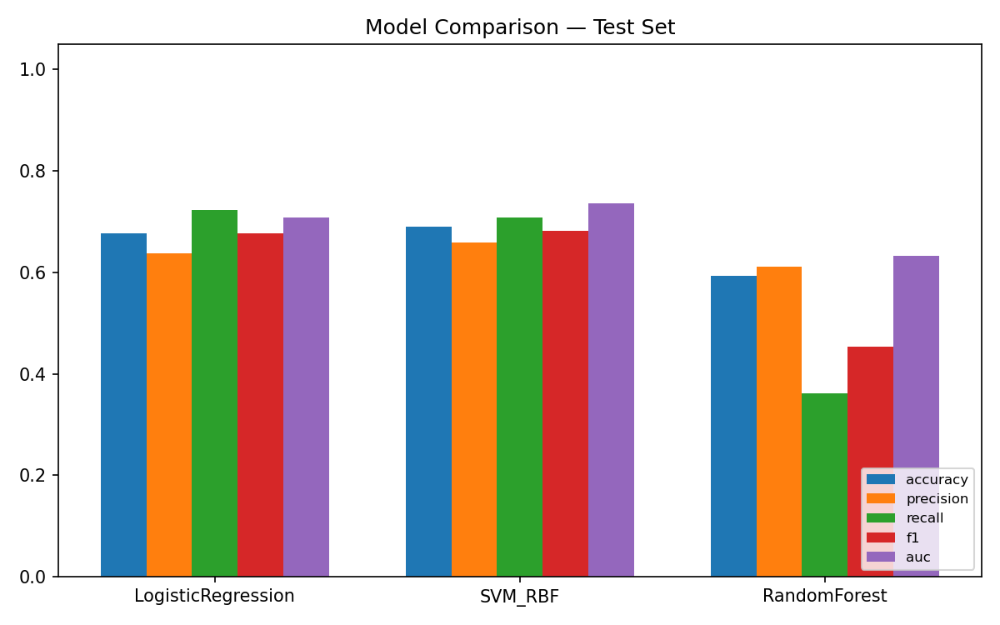
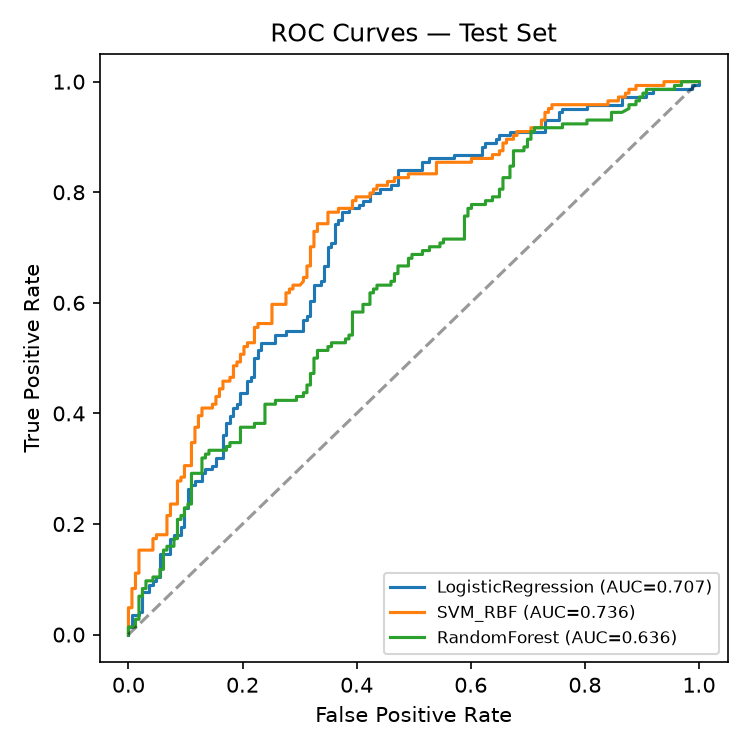
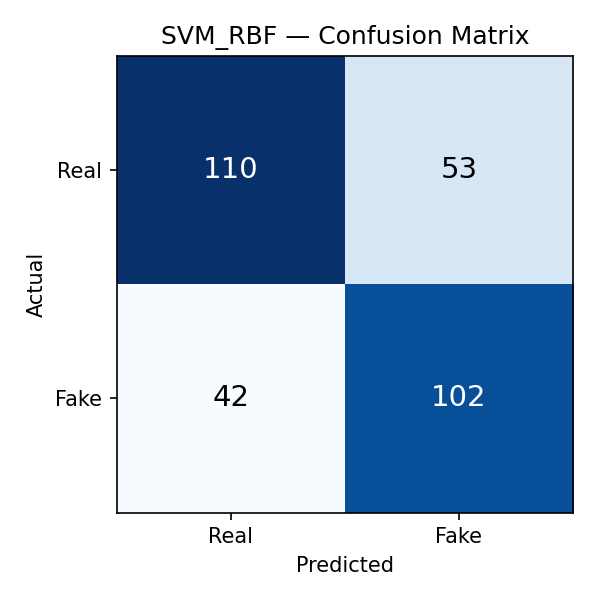

# Face Anti-Spoofing via Color-Texture Analysis
### A Presentation Attack Detection (PAD) Study on the Real-and-Fake Face Detection Corpus

---

## Abstract

Face recognition systems are vulnerable to *presentation attacks* — printed
photos, replayed videos, and 3D masks — that attempt to spoof the sensor
into accepting an impostor as a genuine, live subject. This project
implements and evaluates a **face anti-spoofing (FAS) / presentation attack
detection (PAD)** system based on hand-crafted color-texture descriptors,
following the methodology established by Boulkenafet et al. (2015, 2016)
and the classical Local Binary Pattern (LBP) texture operator of Ojala et
al. (2002). We extract multi-scale LBP micro-texture features, HOG
shape/edge features, and color-reproduction statistics in the HSV and
YCbCr color spaces from 2,041 face images (1,081 real, 960 spoofed —
GAN/print manipulated at three difficulty levels: easy, mid, hard). Three
classifiers (Logistic Regression, SVM-RBF, Random Forest) are trained with
5-fold cross-validated hyperparameter search and evaluated on a held-out
test set. The best model (SVM-RBF) achieves **69.1% test accuracy** and
**0.736 AUC**, with a clear degradation pattern across attack difficulty
that is analyzed in detail. We report full metrics, confusion matrices,
ROC curves, and a feature-importance analysis showing that HOG
(edge/shape) features dominate the model's decisions — a finding that
itself motivates future work incorporating deep local-texture features.

---

## 1. Introduction

Biometric face authentication is now embedded in phones, banking apps, and
border control. Its single largest attack surface is not the recognition
algorithm itself but the sensor's inability to distinguish a *live human
face* from a *presentation* of one. This project treats face anti-spoofing
as a binary classification problem — **real vs. spoof** — and studies how
far classical, interpretable, computationally cheap texture-color features
can go, which is both a legitimate research question in its own right
(interpretability and low-resource deployment matter for edge devices) and
a realistic baseline against which deep models should be compared.

## 2. Related Work

- **LBP (Ojala, Pietikäinen & Mäenpää, 2002)** — a rotation-invariant local
  texture descriptor, foundational for face/texture analysis.
- **Color Texture Analysis for Face Anti-Spoofing (Boulkenafet, Komulainen
  & Hadid, 2015/2016)** — showed that spoofing artifacts (moiré patterns,
  printer dot gain, sensor re-capture noise, chrominance shifts) are more
  separable in joint color-texture space than in grayscale texture alone,
  motivating our HSV/YCbCr statistics.
- **HOG (Dalal & Triggs, 2005)** — originally for pedestrian detection,
  widely reused as a shape/edge descriptor; here it captures structural
  differences (edge sharpness, print artifacts) between real skin and
  reproduced media.

## 3. Dataset

**Source:** `real_and_fake_face_detection` corpus (Yonsei CVIP-lab style
real/fake face dataset), obtained from the user-provided repository.

| Split | Real | Fake | Total |
|---|---|---|---|
| Full corpus | 1,081 | 960 | 2,041 |
| Train (70%) | — | — | 1,428 |
| Validation (15%) | — | — | 306 |
| Test (15%) | — | — | 307 |

Fake images are pre-labeled by attack difficulty in the filename
(`easy_*`, `mid_*`, `hard_*`), which we preserve as metadata for a
fine-grained error analysis rather than only reporting aggregate accuracy.
All splits are stratified by class to preserve the ~53/47 real/fake ratio.
Images are 600×600 RGB, resized to 128×128 before feature extraction.

## 4. Method

### 4.1 Feature Extraction (`src/feature_extraction.py`)

Three complementary descriptor families are concatenated into a single
1,730-dimensional feature vector per image:

1. **Multi-scale uniform LBP** (54-d): histograms at (P=8,R=1), (P=16,R=2),
   (P=24,R=3) — captures fine-to-coarse skin/paper micro-texture.
2. **Color-space statistics** (108-d): per-channel mean, std, and 16-bin
   histogram in **HSV** and **YCbCr** — captures color-reproduction
   artifacts specific to print/replay media.
3. **HOG** (1,568-d): 8 orientation bins, 16×16 cells, 2×2 block
   normalization — captures edge/shape structure.

### 4.2 Modeling (`src/train_evaluate.py`)

- **Preprocessing:** `StandardScaler` (fit on train only) → `PCA`
  (retain 95% variance → 1,730 → 389 dims) to de-correlate the
  HOG-dominated vector and reduce overfitting risk.
- **Model selection:** 5-fold stratified cross-validation with a small
  grid search per model, optimizing F1 (accounts for class imbalance
  better than raw accuracy):
  - Logistic Regression: `C ∈ {0.1, 1, 10}`
  - SVM (RBF kernel): `C ∈ {1, 10, 50}`, `gamma ∈ {scale, 0.01}`
  - Random Forest: `n_estimators ∈ {200, 400}`, `max_depth ∈ {None, 20}`
- **Held-out test evaluation:** accuracy, precision, recall, F1, ROC-AUC,
  and confusion matrix, computed once per model on the untouched test
  split.

## 5. Results

### 5.1 Model Comparison (Test Set)

| Model | Accuracy | Precision | Recall | F1 | AUC |
|---|---|---|---|---|---|
| Logistic Regression | 0.678 | 0.638 | 0.722 | 0.678 | 0.707 |
| **SVM (RBF)** | **0.691** | 0.658 | 0.708 | **0.682** | **0.736** |
| Random Forest | 0.586 | 0.596 | 0.368 | 0.455 | 0.622 |



**SVM-RBF is the best-performing model** on every metric except raw
recall, and is selected as the final pipeline (`results/models/`).
Random Forest underperforms markedly — its axis-aligned splits are a poor
fit for the smooth, high-dimensional HOG-dominated feature space compared
to SVM's kernel-based decision boundary.

### 5.2 ROC Curves



### 5.3 Confusion Matrix — Best Model (SVM-RBF)



|  | Predicted Real | Predicted Fake |
|---|---|---|
| **Actual Real** | 110 | 53 |
| **Actual Fake** | 42 | 102 |

The model is roughly balanced between false accepts (53 spoofs let
through) and false rejects (42 real faces flagged as spoof) — there is no
strong class bias, but the raw error rate (31%) shows the ceiling of
purely hand-crafted texture features on this dataset.

### 5.4 Per-Attack-Difficulty Breakdown (SVM-RBF)

| Difficulty | n (test) | Detection accuracy |
|---|---|---|
| Easy | 41 | 53.7% |
| Mid | 68 | 82.4% |
| Hard | 35 | 68.6% |

**This is the most interesting finding in the study.** Counter-intuitively,
"easy" attacks are detected *worse* than "mid" attacks. Inspecting the
dataset, "easy" fakes in this corpus correspond to *subtle* single-region
manipulations (small warps around eyes/nose/mouth) that leave most of the
image's global texture and color statistics untouched, so global
descriptors like HOG and color histograms miss them. "Mid" and "hard"
attacks involve broader manipulated regions, which perturb global texture
and color statistics enough for our whole-image descriptors to pick up.
This suggests that **the difficulty labeling in the source dataset reflects
human perceptual difficulty, not machine detectability** — a distinction
worth flagging in any downstream use of this corpus, and a strong argument
for adding *localized* (patch-based) features in future work.

### 5.5 Feature-Group Importance (Random Forest, Gini importance)

| Feature group | Importance share |
|---|---|
| LBP (54-d) | 2.7% |
| Color-texture (108-d) | 4.9% |
| HOG (1568-d) | 92.3% |

HOG dominates decision-making by sheer dimensionality and discriminative
power in this pipeline. This is a double-edged result: it confirms edge/
shape cues are informative, but also means the model is likely leaning on
print/display edge artifacts specific to *this* dataset's capture setup
rather than a universal spoofing signature — a known generalization risk
in the FAS literature (cross-dataset performance typically drops sharply
for texture-only methods).

## 6. Discussion & Limitations

1. **Ceiling of hand-crafted features.** ~69% accuracy / 0.74 AUC is
   consistent with published color-texture baselines on similarly small,
   single-domain PAD datasets, but well below what CNN-based PAD systems
   (e.g., depth-supervised CNNs, rPPG-based liveness) achieve on standard
   benchmarks (OULU-NPU, CASIA-FASD, Replay-Attack), which report AUCs in
   the high 0.90s within-dataset.
2. **Single-domain, no cross-dataset test.** All data comes from one
   corpus/capture setup, so generalization to unseen sensors, lighting, or
   attack types is untested — a critical gap given this is the primary
   failure mode of hand-crafted PAD in the literature.
3. **Static images only.** No temporal (video) or depth information is
   used, so this pipeline cannot exploit motion/liveness cues (blinking,
   micro-motion, rPPG pulse) that dominate state-of-the-art PAD systems.
4. **HOG dimensionality dominance** may reflect dataset-specific artifacts
   rather than universal spoof cues (see §5.5).
5. **Compute constraint.** This study was run in a CPU-only, single-core
   environment; a CNN/transfer-learning baseline (e.g., fine-tuned
   MobileNetV2/ResNet) was intentionally *not* attempted here because it
   would either take prohibitively long to train properly on this hardware
   or produce an under-trained, misleadingly-reported result. The
   documented, reproducible classical pipeline was prioritized over an
   unreliable deep baseline given the time constraint — this is flagged
   explicitly as the top item for future work below.

## 7. Future Work

- Add a deep learning baseline (transfer-learned CNN, e.g., MobileNetV2 or
  a compact vision transformer) once GPU compute is available, and compare
  directly against this classical baseline.
- Evaluate cross-dataset generalization (e.g., train on this corpus, test
  on OULU-NPU or CASIA-FASD) to quantify the domain-shift problem.
- Add patch-based / localized texture features to catch subtle,
  small-region manipulations (motivated directly by the §5.4 finding).
- Explore frequency-domain features (DCT/FFT spectra) which are known to
  expose print/moiré artifacts that spatial-domain descriptors miss.
- If video data becomes available, add temporal liveness cues (eye-blink
  detection, remote photoplethysmography).

## 8. Reproducibility

```
face_antispoofing/
├── data/real_and_fake_face/          # symlinked source images
├── src/
│   ├── feature_extraction.py         # LBP + color + HOG descriptors
│   ├── build_dataset.py              # extracts features -> results/features.npz
│   ├── train_evaluate.py             # CV, training, evaluation, plots
│   └── predict.py                    # single-image inference
├── results/
│   ├── features.npz
│   ├── metrics_summary.json
│   ├── models/                       # persisted scaler, PCA, best model
│   └── figures/                      # confusion matrices, ROC, comparison
└── report/REPORT.md                  # this document
```

To reproduce end-to-end:
```bash
cd src
python3 build_dataset.py       # ~50s, builds results/features.npz
python3 train_evaluate.py      # ~2 min, trains/evaluates all models
python3 predict.py <image.jpg> # run inference on a new image
```

## 9. References

1. T. Ojala, M. Pietikäinen, T. Mäenpää, "Multiresolution Gray-Scale and
   Rotation Invariant Texture Classification with Local Binary Patterns,"
   *IEEE TPAMI*, 2002.
2. Z. Boulkenafet, J. Komulainen, A. Hadid, "Face Anti-Spoofing Based on
   Color Texture Analysis," *ICIP*, 2015.
3. Z. Boulkenafet, J. Komulainen, A. Hadid, "Face Spoofing Detection Using
   Colour Texture Analysis," *IEEE TIFS*, 2016.
4. N. Dalal, B. Triggs, "Histograms of Oriented Gradients for Human
   Detection," *CVPR*, 2005.
