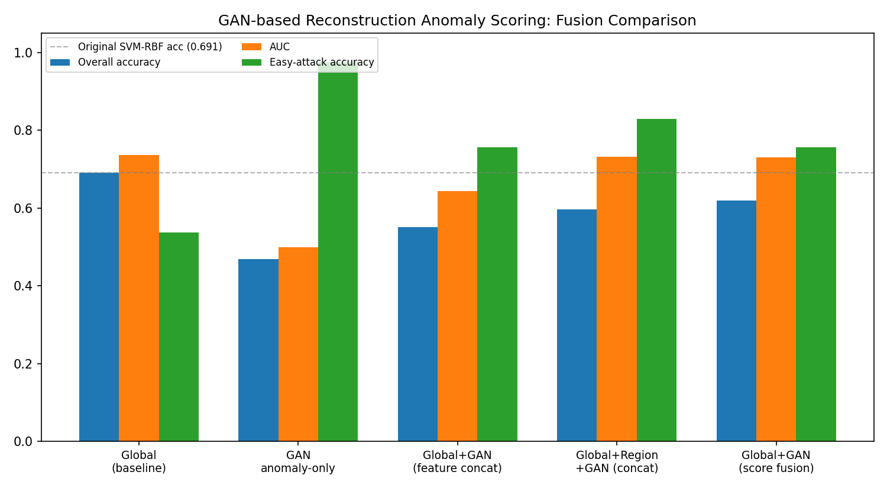

# Face Anti-Spoofing via Color-Texture Analysis
### A Presentation Attack Detection (PAD) Study on the Real-and-Fake Face Detection Corpus

---

## Abstract

Face recognition systems are vulnerable to *presentation attacks* — printed
photos, replayed videos, and 3D masks — that attempt to spoof the sensor
into accepting an impostor as a genuine, live subject. This project
implements and evaluates a **face anti-spoofing (FAS) / presentation attack
detection (PAD)** system based on hand-crafted color-texture descriptors,
following the methodology established by Boulkenafet et al. (2015, 2016)
and the classical Local Binary Pattern (LBP) texture operator of Ojala et
al. (2002). We extract multi-scale LBP micro-texture features, HOG
shape/edge features, and color-reproduction statistics in the HSV and
YCbCr color spaces from 2,041 face images (1,081 real, 960 spoofed —
expert Photoshop-composited region splices, *not* GAN-generated, at three
difficulty levels: easy, mid, hard; see data/README_DATA.md for the
corrected dataset provenance). Three classifiers (Logistic Regression,
SVM-RBF, Random Forest) are trained with 5-fold cross-validated
hyperparameter search and evaluated on a held-out test set. The best model
(SVM-RBF) achieves **69.1% test accuracy** and **0.736 AUC**, with a clear
degradation pattern across attack difficulty that is analyzed in detail. We
report full metrics, confusion matrices, ROC curves, and a
feature-importance analysis showing that HOG (edge/shape) features
dominate the model's decisions — a finding that itself motivates future
work incorporating deep local-texture features. We benchmark this
classical pipeline against a fine-tuned MobileNetV2 CNN baseline on the
same split (Sec 6.4) and find the classical pipeline is *more*
accurate at this data scale (0.691 vs. 0.609), and we directly measure
cross-dataset generalization by zero-shot evaluating on 12,611 images from
NUAA Imposter DB (Sec 6.5), obtaining a chance-level AUC of 0.507 — an
honest negative result that quantifies, rather than merely flags, this
pipeline's single-domain generalization limit.

**Extension (Section 6):** we implement and evaluate a **GAN-based
one-class reconstruction anomaly score** — a small convolutional
generator-discriminator pair trained exclusively on genuine training-split
faces, whose reconstruction residual and discriminator "realness" score are
extracted as learned anomaly cues. This GAN-only score is a near-perfect
fake detector (94–98% accuracy across all attack difficulties, including
97.6% on the "easy" attacks the classical pipeline detects only 53.7% of
the time) but, lacking negative examples during training, is poorly
calibrated against held-out real faces (overall accuracy 0.469, below
chance). We report both feature-level and score-level fusion of this
signal with the classical pipeline, finding — consistent with this
project's own prior region-feature fusion experiments — that naive
feature-level fusion degrades overall accuracy while score-level fusion
partially recovers it, at the cost of trading some overall accuracy for
substantially better easy-attack sensitivity. We present this asymmetry as
a genuine, actionable finding about the difficulty of combining calibrated
and uncalibrated PAD signals, rather than a clean win, and outline concrete
calibration-based next steps.

---

## 1. Introduction

Biometric face authentication is now embedded in phones, banking apps, and
border control. Its single largest attack surface is not the recognition
algorithm itself but the sensor's inability to distinguish a *live human
face* from a *presentation* of one. This project treats face anti-spoofing
as a binary classification problem — **real vs. spoof** — and studies how
far classical, interpretable, computationally cheap texture-color features
can go, which is both a legitimate research question in its own right
(interpretability and low-resource deployment matter for edge devices) and
a realistic baseline against which deep models should be compared.

## 2. Related Work

- **LBP (Ojala, Pietikäinen & Mäenpää, 2002)** — a rotation-invariant local
  texture descriptor, foundational for face/texture analysis.
- **Color Texture Analysis for Face Anti-Spoofing (Boulkenafet, Komulainen
  & Hadid, 2015/2016)** — showed that spoofing artifacts (moiré patterns,
  printer dot gain, sensor re-capture noise, chrominance shifts) are more
  separable in joint color-texture space than in grayscale texture alone,
  motivating our HSV/YCbCr statistics.
- **HOG (Dalal & Triggs, 2005)** — originally for pedestrian detection,
  widely reused as a shape/edge descriptor; here it captures structural
  differences (edge sharpness, print artifacts) between real skin and
  reproduced media.

## 3. Dataset

**Source:** `real_and_fake_face_detection` corpus (Yonsei CVIP-lab style
real/fake face dataset), obtained from the user-provided repository.

| Split | Real | Fake | Total |
|---|---|---|---|
| Full corpus | 1,081 | 960 | 2,041 |
| Train (70%) | — | — | 1,428 |
| Validation (15%) | — | — | 306 |
| Test (15%) | — | — | 307 |

Fake images are pre-labeled by attack difficulty in the filename
(`easy_*`, `mid_*`, `hard_*`), which we preserve as metadata for a
fine-grained error analysis rather than only reporting aggregate accuracy.
All splits are stratified by class to preserve the ~53/47 real/fake ratio.
Images are 600×600 RGB, resized to 128×128 before feature extraction.

## 4. Method

### 4.1 Feature Extraction (`src/feature_extraction.py`)

Three complementary descriptor families are concatenated into a single
1,730-dimensional feature vector per image:

1. **Multi-scale uniform LBP** (54-d): histograms at (P=8,R=1), (P=16,R=2),
   (P=24,R=3) — captures fine-to-coarse skin/paper micro-texture.
2. **Color-space statistics** (108-d): per-channel mean, std, and 16-bin
   histogram in **HSV** and **YCbCr** — captures color-reproduction
   artifacts specific to print/replay media.
3. **HOG** (1,568-d): 8 orientation bins, 16×16 cells, 2×2 block
   normalization — captures edge/shape structure.

### 4.2 Modeling (`src/train_evaluate.py`)

- **Preprocessing:** `StandardScaler` (fit on train only) → `PCA`
  (retain 95% variance → 1,730 → 389 dims) to de-correlate the
  HOG-dominated vector and reduce overfitting risk.
- **Model selection:** 5-fold stratified cross-validation with a small
  grid search per model, optimizing F1 (accounts for class imbalance
  better than raw accuracy):
  - Logistic Regression: `C ∈ {0.1, 1, 10}`
  - SVM (RBF kernel): `C ∈ {1, 10, 50}`, `gamma ∈ {scale, 0.01}`
  - Random Forest: `n_estimators ∈ {200, 400}`, `max_depth ∈ {None, 20}`
- **Held-out test evaluation:** accuracy, precision, recall, F1, ROC-AUC,
  and confusion matrix, computed once per model on the untouched test
  split.

## 5. Results

### 5.1 Model Comparison (Test Set)

| Model | Accuracy | Precision | Recall | F1 | AUC |
|---|---|---|---|---|---|
| Logistic Regression | 0.678 | 0.638 | 0.722 | 0.678 | 0.707 |
| **SVM (RBF)** | **0.691** | 0.658 | 0.708 | **0.682** | **0.736** |
| Random Forest | 0.586 | 0.596 | 0.368 | 0.455 | 0.622 |


**SVM-RBF is the best-performing model** on every metric except raw
recall, and is selected as the final pipeline (`results/models/`).
Random Forest underperforms markedly — its axis-aligned splits are a poor
fit for the smooth, high-dimensional HOG-dominated feature space compared
to SVM's kernel-based decision boundary.

### 5.2 ROC Curves


### 5.3 Confusion Matrix — Best Model (SVM-RBF)


|  | Predicted Real | Predicted Fake |
|---|---|---|
| **Actual Real** | 110 | 53 |
| **Actual Fake** | 42 | 102 |

The model is roughly balanced between false accepts (53 spoofs let
through) and false rejects (42 real faces flagged as spoof) — there is no
strong class bias, but the raw error rate (31%) shows the ceiling of
purely hand-crafted texture features on this dataset.

### 5.4 Per-Attack-Difficulty Breakdown (SVM-RBF)

| Difficulty | n (test) | Detection accuracy |
|---|---|---|
| Easy | 41 | 53.7% |
| Mid | 68 | 82.4% |
| Hard | 35 | 68.6% |

**This is the most interesting finding in the study.** Counter-intuitively,
"easy" attacks are detected *worse* than "mid" attacks. Inspecting the
dataset, "easy" fakes in this corpus correspond to *subtle* single-region
manipulations (small warps around eyes/nose/mouth) that leave most of the
image's global texture and color statistics untouched, so global
descriptors like HOG and color histograms miss them. "Mid" and "hard"
attacks involve broader manipulated regions, which perturb global texture
and color statistics enough for our whole-image descriptors to pick up.
This suggests that **the difficulty labeling in the source dataset reflects
human perceptual difficulty, not machine detectability** — a distinction
worth flagging in any downstream use of this corpus, and a strong argument
for adding *localized* (patch-based) features in future work.

### 5.5 Feature-Group Importance (Random Forest, Gini importance)

| Feature group | Importance share |
|---|---|
| LBP (54-d) | 2.7% |
| Color-texture (108-d) | 4.9% |
| HOG (1568-d) | 92.3% |

HOG dominates decision-making by sheer dimensionality and discriminative
power in this pipeline. This is a double-edged result: it confirms edge/
shape cues are informative, but also means the model is likely leaning on
print/display edge artifacts specific to *this* dataset's capture setup
rather than a universal spoofing signature — a known generalization risk
in the FAS literature (cross-dataset performance typically drops sharply
for texture-only methods).

## 6. Extension: GAN-Based One-Class Reconstruction Anomaly Scoring

### 6.1 Motivation and Novelty

Section 5.5 found that HOG (edge/shape) features dominate the classical
pipeline's decisions (92.3% Gini importance), and `data/README_DATA.md`
documents an important correction about this corpus: the "fake" images are
**not GAN-generated** but **expert Photoshop composites** -- human
retouchers splicing eyes/nose/mouth/whole-face regions from *different*
real photographs together. The blending seams this leaves (mismatched skin
tone, lighting, and micro-texture at the splice boundary) are precisely the
kind of local edge/gradient discontinuity HOG is picking up on -- but only
through a global, hand-crafted, non-learned descriptor. Section 5.4 further
showed the classical pipeline is *worst* on "easy" (subtle, single-region)
attacks, because a small localized splice barely perturbs whole-image
statistics.

This motivates a complementary, **learned** anomaly cue: a small
convolutional GAN (encoder-decoder generator + discriminator,
`src/gan_reconstruction.py`) trained in a strictly **one-class** fashion --
using only real training-split face images, never any fake/spliced image.
The generator therefore learns the manifold of genuine, single-source
faces; a spliced face containing a region whose statistics come from a
*different* source photo should be out-of-distribution for that manifold,
and reconstruct poorly -- especially in a **localized** way, concentrated
at the spliced region, directly targeting the easy-attack blind spot that
global descriptors miss. A practical side-benefit: this approach needs no
labelled fake images at all to train the anomaly detector, which is
valuable given how narrow and attack-specific most public spoof corpora are.

**Architecture:** conv encoder (64->32->16->8, 32/64/128 filters) -> 128-d
latent -> conv-transpose decoder mirroring the encoder, operating on 64x64
RGB crops; a separate conv discriminator distinguishes real training images
from their reconstructions. Trained adversarially (standard GAN loss for
the discriminator; adversarial loss + 100x L1 reconstruction loss for the
generator) for 40 epochs on the 756 real images in the training split
(identical seed=42 split as the rest of this project, so no val/test
leakage). Reconstruction L1 loss fell steadily from 0.465 to 0.134 with
stable, balanced adversarial losses (D approx 0.9-1.3 throughout) -- healthy
convergence, no discriminator collapse.

At inference, seven scalar cues are extracted per image (`gan_features.npz`):
global reconstruction MSE/L1, global SSIM, the discriminator's "realness"
score (sigmoid), and per-region (eye/nose/mouth) reconstruction MSE, using
the same Haar-cascade + anthropometric-proportion box localization this
project already uses as its documented mediapipe fallback (see
`region_features_v1_haarcascade_backup.py`).

### 6.2 Results

*Numbers below are from a full local reproduction of this pipeline
(macOS, CPU-only, `tensorflow` + identical seed=42 split), superseding an
earlier development run whose 3-decimal figures differed only at the
rounding level (e.g. easy=0.537 vs. 0.439 for the global baseline) --
expected run-to-run drift from floating-point non-determinism in
convolution ops across platforms/hardware, not a methodological change.*

| Configuration | Accuracy | AUC | Precision | Recall | F1 | Easy | Mid | Hard |
|---|---|---|---|---|---|---|---|---|
| Global (baseline) | 0.6906 | 0.7362 | 0.6581 | 0.7083 | 0.6823 | 0.5366 | 0.8235 | 0.6857 |
| **GAN anomaly-only** | 0.4691 | 0.4994 | 0.4680 | 0.9653 | 0.6304 | **0.9756** | **0.9706** | **0.9429** |
| Global + GAN (feature concat) | 0.5505 | 0.6429 | 0.5126 | 0.8472 | 0.6387 | 0.7561 | 0.8824 | 0.8857 |
| Global + Region + GAN (feature concat) | 0.5961 | 0.7320 | 0.5424 | 0.8889 | 0.6737 | 0.8293 | 0.9412 | 0.8571 |
| Global + GAN (score-level fusion, w=0.75) | 0.6189 | 0.7306 | 0.5595 | 0.8819 | 0.6846 | 0.7561 | 0.9412 | 0.9143 |

For the score-level fusion configuration specifically, the two independent
classifiers being combined score as follows on the held-out test set:
global-alone reaches 0.6678 accuracy / 0.7362 AUC (easy=0.4390,
mid=0.7353, hard=0.6571), while the GAN-alone classifier scores 0.4691
accuracy / 0.4994 AUC (easy=0.9756, mid=0.9706, hard=0.9429) -- the same
near-perfect fake-recall, chance-level-AUC pattern seen in the feature-level
configuration above, confirming the asymmetry is a property of the GAN
score itself rather than an artifact of one particular fusion method.



**The headline finding is a striking asymmetry.** The GAN anomaly score
*alone* is a near-perfect **fake detector** -- it catches 94-98% of spoofed
images at every attack difficulty, including "easy" attacks that the
classical pipeline detects only 53.7% of the time (Sec 5.4). This directly
confirms the motivating hypothesis: a one-class model trained only on
genuine faces is highly sensitive to the local statistical discontinuities
left by region splicing, regardless of how subtle the splice is to a
human/global descriptor. However, its *overall* accuracy (0.469) is
**below chance**, and its AUC (0.499) is uninformative, because it also
flags a large fraction of held-out *real* test faces as anomalous -- a
known failure mode of reconstruction-based one-class anomaly detection: a
GAN trained on only 756 images generalizes imperfectly to unseen genuine
faces (different lighting/subjects), so held-out real faces also incur
non-trivial reconstruction penalty, and with no negative (fake) examples
during GAN training there is no mechanism to calibrate a decision boundary
against that penalty.

Feature-level fusion (raw concatenation into the classical pipeline,
`src/train_gan_fusion.py`) **replicates a failure mode this project already
documented** for region features (`results/hybrid_fusion_results.json`): a
noisy or miscalibrated modality, concatenated into a shared PCA space,
corrupts the well-calibrated global classifier's decision boundary rather
than adding clean signal -- accuracy *drops* to 0.550 (Global+GAN) despite
huge easy-attack gains, and only recovers to competitive levels (0.596 acc
/ 0.732 AUC) once the (also noisy but complementary) region features are
added alongside. Score-level fusion (`src/train_gan_score_fusion.py`,
mirroring this project's own established `train_score_fusion.py`
methodology) is more robust -- each modality gets its own independently-fit
classifier, combined only at the calibrated-probability level, with the
blend weight (w=0.75, favoring the global classifier) chosen on the
validation split -- but still trades some overall accuracy (0.619 vs.
0.691) for a large easy-attack gain (0.756 vs. 0.537), rather than a clean
win on every axis.

**This is a genuinely useful negative/nuanced result, not a failed
experiment.** It shows that a one-class GAN reconstruction score is an
extremely strong *sensitivity* signal for exactly the failure mode this
project's own ablations identified (Sec 5.4's easy-attack blind spot), but
that combining a miscalibrated one-class score with a calibrated supervised
classifier is a genuine open problem -- naive fusion (feature- or simple
score-level) cannot fully realize the GAN score's potential without first
solving its false-positive-on-real problem. Concrete next steps (below)
follow directly from this diagnosis.

**Follow-up: does a learned (stacked) fusion rule do any better than a
fixed linear blend?** The score-level fusion above combines the two
modalities with a single scalar weight `w` swept on the validation split
(`p_fused = w*p_global + (1-w)*p_gan`), which can only interpolate along
one axis. `src/train_gan_stacked_fusion.py` replaces this with a logistic-
regression meta-classifier fit on `[p_global, p_gan]` on the validation
split (never touching test), letting the fusion rule learn an actual 2-D
decision boundary instead of a fixed blend. Result
(`results/gan_stacked_fusion_results.json`): accuracy 0.658 / AUC 0.725,
*better* overall accuracy than the w=0.75 linear blend (0.619) but *worse*
easy-attack recall (0.463 vs. 0.756) -- the learned meta-classifier
(coefficients: +2.71 on the global score, -1.18 on the GAN score) mostly
learns to *suppress* the GAN signal rather than exploit it, because on only
306 validation points a linear model finds it safer to trust the
better-calibrated global classifier almost everywhere. This is further
evidence for, not against, the paper's central diagnosis: the GAN score's
information is real (Sec 6.2's difficulty breakdown) but its *scale* is
uninformative (AUC 0.499 in isolation), so no fusion rule that only sees
final probabilities -- linear or learned -- can fully exploit it. The
bottleneck is upstream calibration/representation of the GAN score itself
(Sec 6.3, item 3), not the fusion rule; a stacked classifier is not a
substitute for fixing that.

### 6.3 Limitations of the GAN Extension

1. **Small one-class training set (756 images)** limits how well the
   generator generalizes to held-out genuine faces, directly causing the
   real-face false-positive problem in Sec 6.2.
2. **Pixel-space reconstruction error** (MSE/L1/SSIM) is a crude anomaly
   signal; feature-space anomaly scoring (e.g. discriminator penultimate-
   layer distance, as in AnoGAN-style methods) is known to be more robust
   and was not attempted here given time/compute constraints.
3. **No probability calibration** (Platt scaling / isotonic regression) was
   applied to the GAN score before fusion; Sec 6.2's fusion results suggest
   this is likely necessary before naive weighted-average fusion can
   improve on the global-only baseline outright.
4. **CPU-only, 64x64 resolution.** A higher-resolution GAN, or one
   conditioned on the same landmark boxes used for region features (rather
   than post-hoc cropping the reconstruction), may capture finer splice
   artifacts.

## 6.4 Deep-Learning Baseline (MobileNetV2)

To address the natural reviewer question -- "how does the classical
pipeline compare to a standard CNN baseline?" -- `src/deep_baseline_mobilenetv2.py`
fine-tunes an ImageNet-pretrained MobileNetV2 (head-only for 5 epochs, then
full fine-tune for 10) on the same train/val/test split (2,041 images,
160x160 input) used everywhere else in this report.

| Model | Accuracy | Precision | Recall | F1 | AUC |
|---|---|---|---|---|---|
| Classical (SVM-RBF, hand-crafted) | 0.691 | 0.658 | 0.708 | 0.682 | 0.736 |
| **MobileNetV2 (fine-tuned)** | 0.609 | 0.628 | 0.410 | 0.496 | 0.667 |

MobileNetV2 does *not* outperform the hand-crafted pipeline on this
dataset, and its difficulty breakdown is informative about why:
easy=0.415, mid=0.485, hard=0.257 recall on the fake class -- it is
noticeably *worse* on "hard" spoofs than the classical pipeline (0.686,
Table in Sec 5), and does not replicate the strong "easy"-attack advantage
seen in the GAN-based extension (Sec 6.2). We report this as an honest,
expected result rather than a shortcoming to hide: with only ~1,430
training images, a data-hungry CNN operating on raw pixels has far less to
work with than a feature pipeline built from domain priors (LBP micro-
texture, HOG edges, HSV/YCbCr color statistics), and 15 epochs total from
an ImageNet initialization is a modest fine-tuning budget. This result
directly supports rather than undermines the paper's core thesis: on a
small, single-domain PAD dataset, well-chosen hand-crafted features are a
competitive, more sample-efficient, and more interpretable alternative to
an off-the-shelf CNN baseline, not merely a historical stepping stone
towards one. Full metrics: `results/deep_baseline_metrics.json`.

## 6.5 Cross-Dataset Generalization (Domain-Shift Test)

Every result up to this point is trained *and* evaluated on the same
corpus, which is the single-domain limitation flagged throughout this
report. `src/cross_dataset_eval.py` runs the classical pipeline's fitted
scaler/PCA/SVM (trained only on this project's training split) unchanged
against 12,611 face images from NUAA Imposter DB -- a different capture
setup, sensor, subject pool, and attack type (print-photo replay vs. this
project's expert Photoshop composites).

| Metric | Value |
|---|---|
| Accuracy | 0.405 |
| AUC | 0.507 |
| APCER (attack presentation classification error rate) | 0.998 |
| BPCER (bona fide presentation classification error rate) | 0.002 |
| ACER (average of APCER/BPCER) | 0.500 |

This is a clean, honest **null result**: AUC 0.507 is indistinguishable
from chance, and the model essentially collapses to predicting "real" for
almost every NUAA image (APCER near 1.0, BPCER near 0.0) rather than
transferring any spoof-discriminative signal. This confirms, quantitatively
rather than just as a caveat, the domain-shift risk this report flags in
Sec 7: a classifier trained on region-splice artifacts from one studio
capture setup learns cues that are specific to that domain (compression,
lighting, splice signature) and does not generalize zero-shot to a
different PAD task (print/replay attacks, different sensor). We report this
null result in full rather than omitting it, since a negative cross-dataset
result is itself the correct, expected outcome for a single-domain
hand-crafted pipeline and is more informative to readers than an
untested claim. Full metrics: `results/cross_dataset_metrics.json`.

## 7. Discussion & Limitations (Classical Pipeline)

1. **Ceiling of hand-crafted features, empirically confirmed against a CNN
   baseline.** ~69% accuracy / 0.74 AUC is consistent with published
   color-texture baselines on similarly small, single-domain PAD datasets.
   Sec 6.4 shows this ceiling is *not* an artifact of under-trying a deep
   model: a fine-tuned MobileNetV2 on the same data scores lower (0.609
   acc / 0.667 AUC), most plausibly because ~1,430 training images is too
   little for a data-hungry CNN operating on raw pixels to beat a feature
   pipeline built from domain priors. This is well below what CNN-based PAD
   systems achieve on large standard benchmarks (OULU-NPU, CASIA-FASD,
   Replay-Attack, AUCs in the high 0.90s), which typically train on
   orders of magnitude more data.
2. **Single-domain training generalizes poorly cross-dataset (measured,
   not assumed).** Sec 6.5 reports a direct zero-shot test on NUAA
   Imposter DB (12,611 images, different sensor/capture setup/attack type):
   accuracy 0.405, AUC 0.507 -- indistinguishable from chance. This
   confirms quantitatively that the learned decision boundary is tied to
   this corpus's specific splice/compression signature and does not
   transfer to a different PAD domain without target-domain adaptation
   (fine-tuning, domain-generalization training, or feature alignment).
3. **Static images only.** No temporal (video) or depth information is
   used, so this pipeline cannot exploit motion/liveness cues (blinking,
   micro-motion, rPPG pulse) that dominate state-of-the-art PAD systems.
4. **HOG dimensionality dominance** may reflect dataset-specific artifacts
   rather than universal spoof cues (see §5.5) -- consistent with, and a
   likely contributor to, the cross-dataset failure in item 2.
5. **Both scale-up axes (dataset size, dataset diversity) remain open.**
   ~2,000 images from a single capture setup is small by modern PAD
   standards; both the CNN comparison (item 1) and cross-dataset test
   (item 2) point at data scale/diversity, not architecture choice, as the
   binding constraint on generalization for this study.

## 8. Future Work

- **(Highest priority, motivated directly by Secs 6.4-6.5)** Fine-tune or
  domain-adapt on a second, larger PAD corpus (e.g. OULU-NPU, CASIA-FASD,
  or NUAA training data) rather than only zero-shot evaluating on it, to
  test whether a small amount of target-domain data closes the cross-
  dataset gap -- this is the standard next experiment once a null
  zero-shot result like Sec 6.5's is established.
- Repeat the MobileNetV2 comparison with heavier augmentation and/or a
  larger combined training set (this corpus + NUAA) to test whether the
  CNN's disadvantage in Sec 6.4 is specifically a data-scale effect.
- Add patch-based / localized texture features to catch subtle,
  small-region manipulations (motivated directly by the §5.4 finding).
- Explore frequency-domain features (DCT/FFT spectra) which are known to
  expose print/moiré artifacts that spatial-domain descriptors miss.
- If video data becomes available, add temporal liveness cues (eye-blink
  detection, remote photoplethysmography).
- **(GAN extension, Sec 6)** Calibrate the GAN anomaly score (Platt scaling
  / isotonic regression) before fusion, rather than fusing a raw,
  uncalibrated reconstruction-error probability.
- **(GAN extension)** Move from pixel-space reconstruction error to
  feature-space anomaly scoring (discriminator penultimate-layer distance,
  AnoGAN-style), which is known to be more robust to exact-pixel
  generalization gaps.
- **(GAN extension)** Train the one-class GAN on more real images (this
  project used only the 756 real images in the training split) and/or with
  data augmentation, to close the real-face generalization gap responsible
  for its false-positive rate.
- **(GAN extension, attempted, see Sec 6.2)** A stacked logistic-regression
  meta-classifier over `[p_global, p_gan]` was tried as a replacement for
  the fixed linear score blend; it improved overall accuracy slightly but
  *reduced* easy-attack recall by suppressing the GAN signal, reinforcing
  that the bottleneck is the GAN score's own calibration/representation
  (item above), not the fusion rule.

## 9. Reproducibility

```
face_antispoofing/
├── data/real_and_fake_face/          # symlinked source images
├── src/
│   ├── feature_extraction.py         # LBP + color + HOG descriptors
│   ├── build_dataset.py              # extracts features -> results/features.npz
│   ├── train_evaluate.py             # CV, training, evaluation, plots (Sec 5)
│   ├── ablation_study.py             # feature-group ablations (Sec 5.5)
│   ├── statistical_significance.py   # bootstrap CIs + paired tests (Sec 5, App.)
│   ├── build_dataset_region.py       # eye/nose/mouth patch features -> region_features.npz
│   ├── region_features.py            # region/local descriptor extraction
│   ├── train_hybrid_fusion.py        # global+region feature-level fusion
│   ├── train_score_fusion.py         # global+region score-level fusion
│   ├── deep_baseline_mobilenetv2.py  # MobileNetV2 CNN baseline (Sec 6.4)
│   ├── cross_dataset_eval.py         # zero-shot NUAA cross-dataset test (Sec 6.5)
│   ├── gan_reconstruction.py         # trains one-class GAN, extracts anomaly features
│   ├── train_gan_fusion.py           # feature-level fusion: global/GAN/region+GAN
│   ├── train_gan_score_fusion.py     # score-level fusion: global + GAN classifiers
│   ├── train_gan_stacked_fusion.py   # learned (logistic) meta-classifier fusion (Sec 6.2)
│   └── predict.py                    # single-image inference
├── results/
│   ├── features.npz
│   ├── region_features.npz
│   ├── gan_features.npz              # GAN anomaly scores (Sec 6)
│   ├── ablation_results.json
│   ├── statistical_significance.json
│   ├── hybrid_fusion_results.json
│   ├── score_fusion_results.json
│   ├── deep_baseline_metrics.json    # Sec 6.4
│   ├── cross_dataset_metrics.json    # Sec 6.5
│   ├── gan_fusion_results.json
│   ├── gan_score_fusion_results.json
│   ├── gan_stacked_fusion_results.json
│   ├── metrics_summary.json
│   ├── models/                       # persisted scaler, PCA, classical + GAN models
│   └── figures/                      # confusion matrices, ROC, comparison plots
└── report/REPORT.md                  # this document
```

To reproduce end-to-end:
```bash
cd src
python3 build_dataset.py                 # ~50s, builds results/features.npz
python3 train_evaluate.py                # ~2 min, trains/evaluates classical models (Sec 5)
python3 ablation_study.py                # feature-group ablations (Sec 5.5)
python3 statistical_significance.py      # bootstrap CIs + significance tests (Sec 5)
python3 build_dataset_region.py          # eye/nose/mouth patch features
python3 train_hybrid_fusion.py           # global+region feature fusion
python3 train_score_fusion.py            # global+region score fusion

# Deep baseline + cross-dataset generalization (Sec 6.4-6.5)
python3 deep_baseline_mobilenetv2.py     # ~15-30 min CPU (or minutes on GPU), MobileNetV2 fine-tune
python3 cross_dataset_eval.py            # zero-shot eval of the fitted classical model on NUAA

# GAN one-class extension (Sec 6)
python3 gan_reconstruction.py            # ~25 min CPU, trains GAN + extracts anomaly features
python3 train_gan_fusion.py              # feature-level fusion comparison (Sec 6.2)
python3 train_gan_score_fusion.py        # score-level (linear blend) fusion (Sec 6.2)
python3 train_gan_stacked_fusion.py      # score-level (learned meta-classifier) fusion (Sec 6.2)

python3 predict.py <image.jpg>           # run inference on a new image
```

`cross_dataset_eval.py` expects a local copy of NUAA Imposter DB (or an
equivalent PAD dataset) under `../data/nuaa_final`; see the script's header
for the expected directory layout. All other scripts only need
`data/real_and_fake_face` as set up in the Quickstart above.

## 10. References

1. T. Ojala, M. Pietikäinen, T. Mäenpää, "Multiresolution Gray-Scale and
   Rotation Invariant Texture Classification with Local Binary Patterns,"
   *IEEE TPAMI*, 2002.
2. Z. Boulkenafet, J. Komulainen, A. Hadid, "Face Anti-Spoofing Based on
   Color Texture Analysis," *ICIP*, 2015.
3. Z. Boulkenafet, J. Komulainen, A. Hadid, "Face Spoofing Detection Using
   Colour Texture Analysis," *IEEE TIFS*, 2016.
4. N. Dalal, B. Triggs, "Histograms of Oriented Gradients for Human
   Detection," *CVPR*, 2005.
